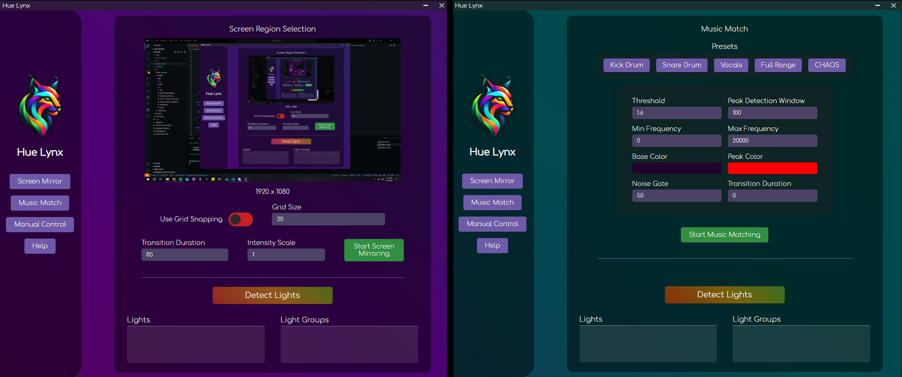

# Hue Lynx
An un-official desktop app to control Lifx brand lights. 

## Download / Installation
[Download Latest Windows Release - V1.01](https://drive.google.com/file/d/1SN4XHH2E4XKy8onRe0EucJeE374uLRg3/view?usp=drive_link)

After downloading, extract the files and run HueLynx.exe. 
Windows may warn about it being from an untrusted source but you can click "more" to proceed. If you don't want to run it as a .exe file, please see below to run it from the source code yourself.

Mac Version is in Progress.

## Features:
* **Screen Mirroring**: The lights can be set to match the average color of your screen. The region of the screen used can be modified using the region selector UI.

* **Music Matching**: In Music Match mode, the lights will trigger at the beat of your music. The frequency and peak detection parameters can be customized to match your specific type of music. Music Matching only works on Windows currently.

* **Manual Control**: If you simply want to change the color of your lights manually, you can do that too!

## Planned Features: 
* Effects in the Manual Control page such as fire, rainbow, etc.

* Music Matching support for Linux/Mac.

## Feedback / Bug Reports
If you have any feedback, feature requests, or bug reports, feel free to make an issue on this page.

For bug reports, please be as descriptive as possible and make sure to include your operating system, Hue Lynx version, and steps on how to reproduce the bug.

## Building From Source
The app is built using Electron js + Vite. The following steps should allow you to build from source:

* npm install
* npm run dev

## Disclaimer
This project is not affiliated with the Lifx brand in any way. This is not an official Lifx application. Use at your own risk.

##
**Special Thanks to mclarkk for his Lifx Lan Protocol implementation in Python. This project would not be possible without it.**

**https://github.com/mclarkk/lifxlan**

## Donate
If you like this project, please consider [donating](https://ko-fi.com/polymir).
This project is completely free and open source, and any donations are greatly appreciated. Thanks!

